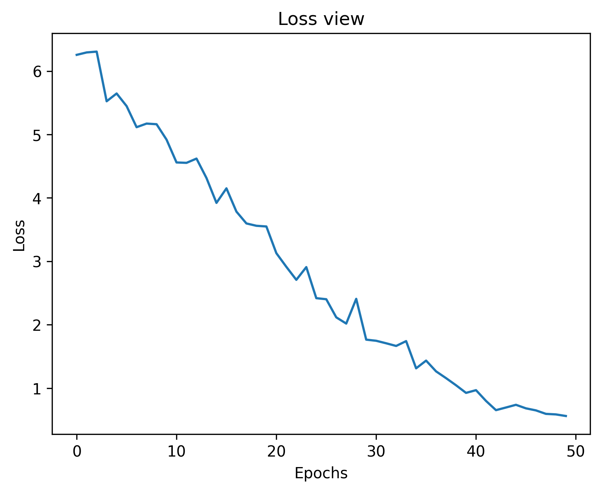

# tinyGPT

## Overview 
This work aim to study GPT architecture and make an optimization roadmap for Training and Model size constraint.

## Full Basic Training:
For a basic full training, make this:
### Get Data & Build Tokenizer:
```bash
python3 data/get_data.py
```

### Train the model:
```bash
python3 main.py 
```

### Make inference with that:
```bash
pyhon3 predict.py
```

### Experimentation Results:
**Loss:** 0.5604
**Epochs:** 50


# Technologies
# Technologies


* **Core:** Python 3.9+
* **Framework:** PyTorch (Neural Network implementation)
* **Visualization:** Torchview (Architecture graph rendering)


